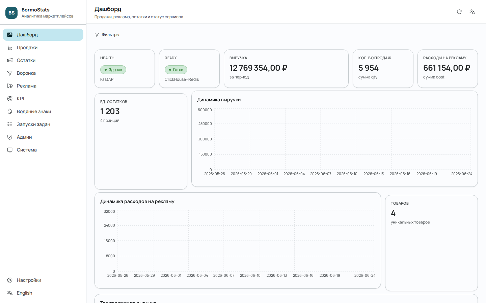
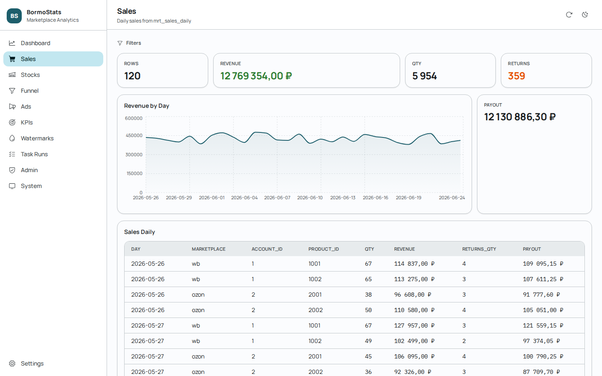
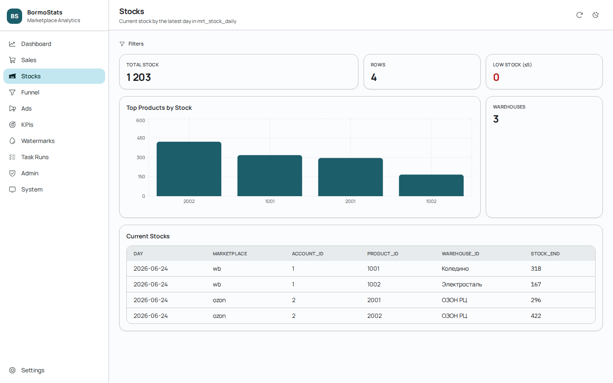
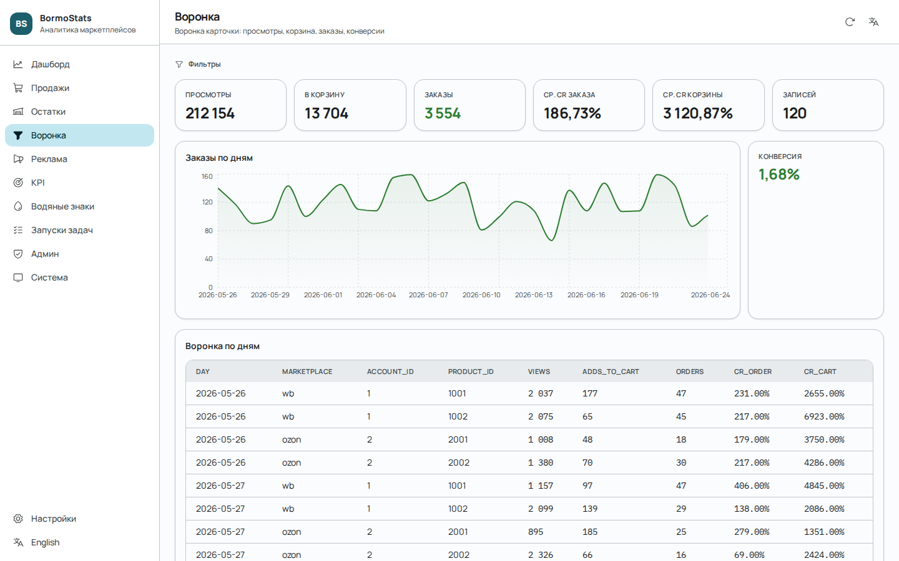
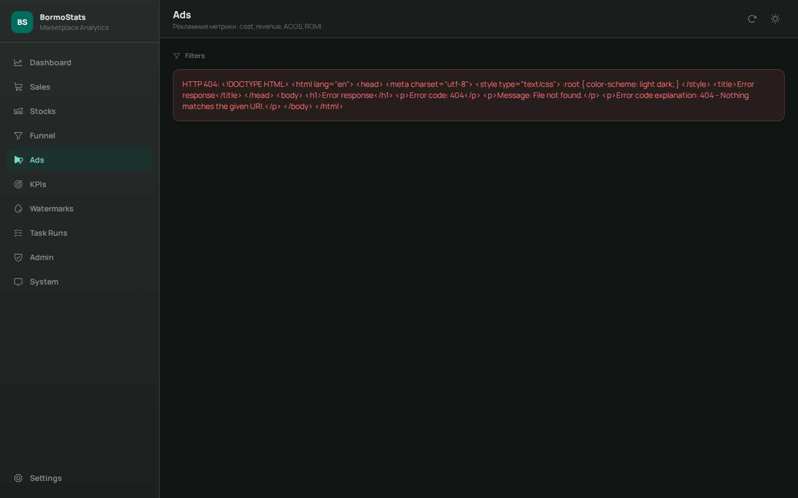
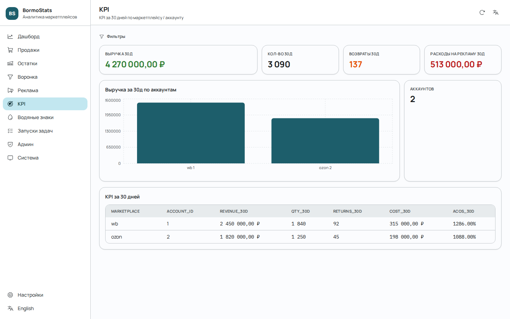
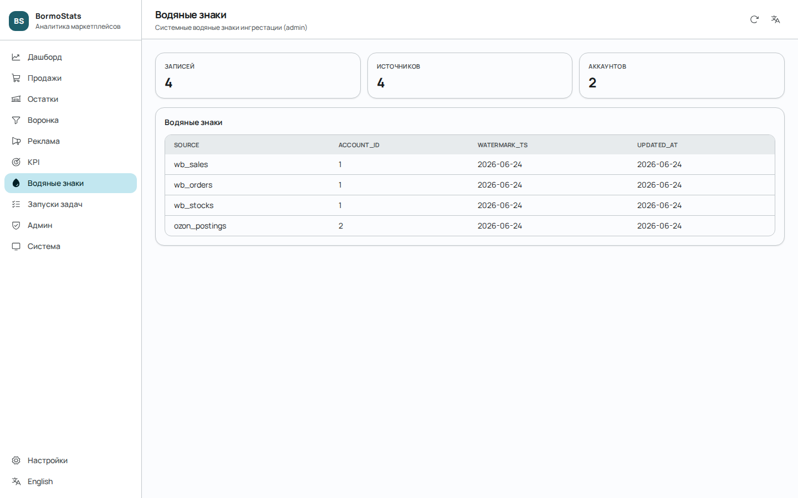
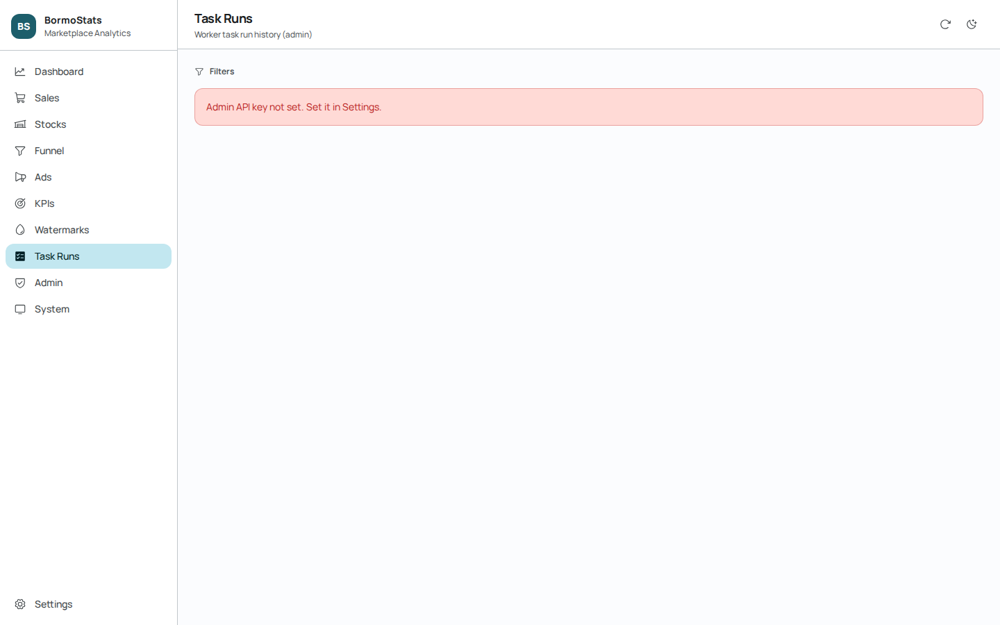
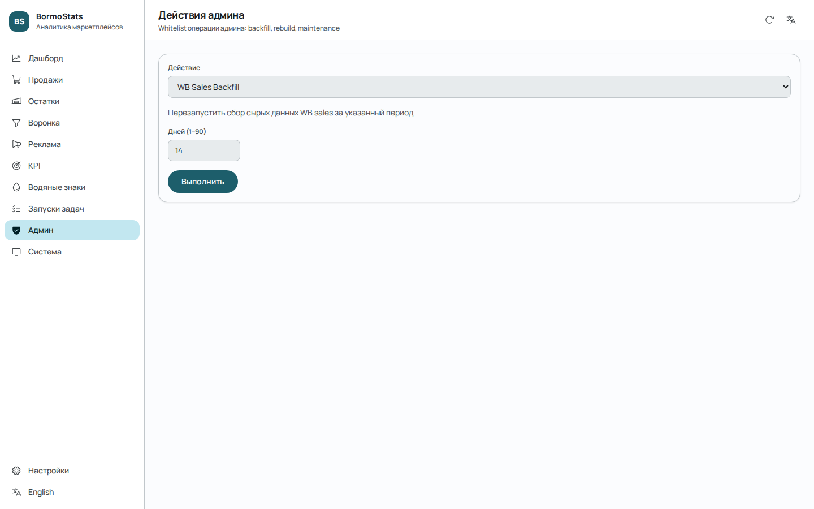
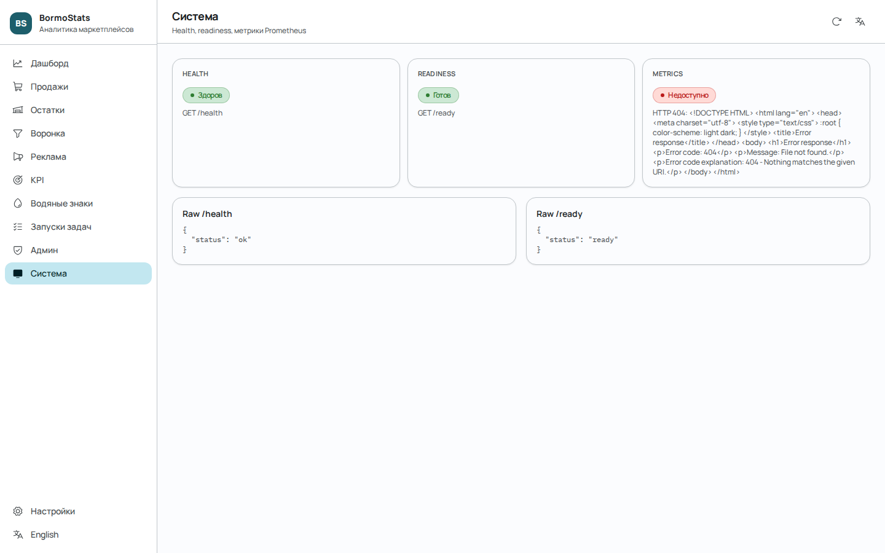

<picture>
  <source media="(prefers-color-scheme: dark)" srcset="screenshots/dashboard.png">
  
</picture>

<div align="center">

# 📊 BormoStats

**Собственная аналитика маркетплейсов для продавцов Wildberries и Ozon**

[](https://github.com/Bormotoon/BormoStats/actions/workflows/ci.yml)
[](https://www.python.org/)
[](https://fastapi.tiangolo.com/)
[](https://react.dev/)
[](https://clickhouse.com/)
[](LICENSE)
[](https://docker.com/)
[](/CONTRIBUTING.md)

---

<p align="center">
  <strong>Русский</strong> •
  <a href="README.md"><strong>English</strong></a>
</p>

[Возможности](#-возможности) • [Быстрый старт](#-быстрый-старт) • [Архитектура](#-архитектура) • [Скриншоты](#-скриншоты) • [API](#-api) • [Конфигурация](#-конфигурация) • [Документация](#-документация) • [Участие](#-участие)

</div>

---

## 🚀 Возможности

| Возможность | Описание |
|---|---|
| **Автоматический сбор данных** | Инкрементальный сбор продаж, заказов, остатков, воронок, рекламы и финансов из API Wildberries и Ozon |
| **Аналитическое хранилище** | Трёхуровневое хранилище в ClickHouse (raw → staging → marts) |
| **REST API** | FastAPI бэкенд с эндпоинтами для продаж, остатков, воронок, рекламы и KPI |
| **Современный веб-интерфейс** | Встроенное React 19 SPA с Material Design 3 и двуязычным интерфейсом |
| **BI Дашборды** | Интеграция с Metabase для произвольных дашбордов и SQL-запросов |
| **Telegram Уведомления** | YAML-правила автоматизации: высокий ACOS, низкий остаток, отсутствие продаж |
| **Биддер** | Автоматическое управление ставками для РК WB/Ozon с правилами по CPM/позиции |
| **Репрайсер** | Динамическое ценообразование с валидацией маржи и break-even анализом |
| **P&L** | Полный отчёт о прибылях и убытках с учётом косвенных расходов |
| **ABC/XYZ** | Автоматический анализ ассортимента (доля в выручке + стабильность спроса) |
| **Actionable Insights** | Ежедневное сканирование аномалий → очередь задач с Telegram-дайджестом |
| **PIM** | Обогащение карточек товаров: бренды, категории, SEO, AI-генерация описаний |
| **Webhooks** | Эндпоинт загрузки остатков (1С/МойСклад), webhook подписки |
| **Admin API** | Бэкфилл, трансформации, водяные знаки, аудит задач и обслуживание |
| **Мониторинг** | Prometheus метрики, Grafana дашборды, правила оповещений |
| **Безопасность цепочки поставок** | pip-audit, сканирование Docker образов (Grype), генерация SBOM (SPDX) |

### Границы проекта

- ✅ Собирает данные **только** с ваших собственных аккаунтов продавца
- ✅ Полностью самостоятельно размещаемый — данные не отправляются третьим лицам
- ❌ Не парсит данные конкурентов или каталоги маркетплейсов
- ❌ Не предоставляет аналитику по рынку в целом

---

## 🖼️ Скриншоты

| Страница | Превью | Описание |
|---|---|---|
| **Dashboard** |  | Обзор работы сервиса: здоровье сервера, выручка, количество продаж, расходы на рекламу, остатки, тренды выручки/рекламы, таблица топ-товаров |
| **Sales** |  | Аналитика продаж по дням: агрегированная выручка, количество, возвраты, выплаты — график тренда и таблица с фильтрами по маркетплейсу и аккаунту |
| **Stocks** |  | Текущие остатки: общее количество, предупреждения о низких остатках, распределение по складам, бар-чарт топ-товаров |
| **Funnel** |  | Воронка конверсии: просмотры, добавления в корзину, заказы — средние CR корзины/заказа, тренд заказов по дням |
| **Ads** |  | Эффективность рекламы: расходы, выручка, клики, заказы, ACOS, ROMI — двойной тренд (расходы vs выручка по дням) |
| **KPIs** |  | 30-дневные KPI: выручка, количество, возвраты, расходы на рекламу с группировкой по маркетплейсу/аккаунту и столбчатая диаграмма |
| **Watermarks** |  | Admin — курсоры водяных знаков инкрементальной загрузки (wb_sales, ozon_postings и т.д.) |
| **Task Runs** |  | Admin — аудит задач воркеров со статусом выполнения, количеством строк, сообщениями об ошибках |
| **Admin Actions** |  | Admin — панель операций бэкфилла, трансформаций и обслуживания с выбором периода и просмотром ответа |
| **System** |  | Здоровье сервиса, готовность и образцы Prometheus метрик |

---

## 🏗️ Архитектура

```
┌─────────────────────────────────────────────────────────────────────┐
│                    CELERY BEAT (Планировщик)                        │
│    Запускает сборщики, трансформации, marts, автоматизацию, чистку  │
└────────────┬────────────────┬──────────────────┬───────────────────┘
             │                │                  │
             ▼                ▼                  ▼
┌─────────────────┐ ┌─────────────────┐ ┌───────────────────────────┐
│  WB Collector   │ │  Ozon Collector │ │  Transforms & Marts       │
│  (API клиент)   │ │  (API клиент)   │ │  (SQL трансформации)     │
└────────┬────────┘ └────────┬────────┘ └─────────────┬─────────────┘
         │                   │                        │
         ▼                   ▼                        ▼
┌──────────────────────────────────────────────────────────────────────┐
│                     CLICKHOUSE (Хранилище данных)                    │
│    raw_* → stg_* → mrt_*  |  sys_watermarks  |  sys_task_runs       │
└─────────────────────────────┬────────────────────────────────────────┘
                              │
                              ▼
┌───────────────────────────────────────────────────────┐
│              FastAPI Бэкенд                            │
│  /api/v1/* (аналитика)  /api/v1/admin/* (администрирование)│
│  /ui (веб-интерфейс)  /metrics (Prometheus)           │
└─────────────────────────┬─────────────────────────────┘
                          │
                          ▼
┌──────────────────────────────┐  ┌──────────────┐
│  Nginx Reverse Proxy (TLS)  │  │   Metabase   │
│  → точка входа               │  │  (BI дашборды)│
└──────────────────────────────┘  └──────────────┘
```

### Компоненты

| Компонент | Технология | Назначение |
|---|---|---|
| **Бэкенд** | FastAPI + Uvicorn | REST API, веб-интерфейс, health/ready/metrics |
| **Воркер** | Celery | Сбор данных, трансформации, marts, автоматизация |
| **Beat** | Celery Beat | Планировщик периодических задач |
| **ClickHouse** | ClickHouse 26.x | OLAP аналитическое хранилище |
| **Redis** | Redis 7.x | Брокер Celery + распределённые блокировки |
| **Nginx** | Nginx 1.27 | Обратный прокси с TLS терминацией |
| **Metabase** | Metabase | BI платформа для дашбордов |
| **Prometheus** | Prometheus | Сбор метрик и оповещения |

### Конвейер данных

Данные проходят через три слоя обработки:

1. **Raw слой** (`raw_*`) — Сырые ответы API с JSON и нормализованными ключевыми полями для идемпотентной загрузки
2. **Staging слой** (`stg_*`) — Каноническая нормализованная модель с единой схемой для WB и Ozon
3. **Mart слой** (`mrt_*`) — Агрегированные BI-представления для дашбордов и API

### Технологический стек

| Категория | Технологии |
|---|---|
| **Язык** | Python 3.14 |
| **Веб-фреймворк** | FastAPI 0.135, Uvicorn 0.41 |
| **Очередь задач** | Celery 5.6, Redis 7.2 |
| **Хранилище** | ClickHouse 26.x (clickhouse-connect 0.13) |
| **Фронтенд** | React 19, Vite 8, Tailwind CSS 4, Recharts 3, Motion |
| **HTTP клиент** | httpx 0.28 |
| **Валидация** | Pydantic 2.12, pydantic-settings 2.13 |
| **Метрики** | prometheus_client 0.24 |
| **Логирование** | structlog 25.5 (структурированный JSON) |
| **Автоматизация** | PyYAML 6.0 (YAML-движок правил) |
| **BI** | Metabase (Docker) |
| **Инфраструктура** | Docker Compose, Nginx, Prometheus, Grafana |
| **Линтинг** | Ruff 0.15 |
| **Типизация** | MyPy 1.19 (строгий режим) |
| **Тесты** | pytest 9.0, pytest-asyncio |
| **Безопасность** | pip-audit, Anchore Grype, SPDX SBOM |

---

## ⚡ Быстрый старт

### Требования

- Активные аккаунты продавцов Wildberries и/или Ozon с API токенами
- **make** (для команд быстрого запуска)

### Вариант A: Docker (рекомендуется)

Требуется **Docker** и **Docker Compose v2**.

```bash
git clone https://github.com/Bormotoon/BormoStats.git
cd BormoStats
cp .env.example .env
```

Отредактируйте `.env` и укажите **как минимум** эти значения:

| Переменная | Где взять |
|---|---|
| `WB_STATISTICS_API_KEY` | Wildberries → Личный кабинет → Настройки → API |
| `OZON_CLIENT_ID` | Ozon → Настройки → API |
| `OZON_API_KEY` | Ozon → Настройки → API |
| `ADMIN_API_KEY` | Сгенерировать: `openssl rand -hex 32` |

```bash
make up
```

Запускает ClickHouse, Redis, Бэкенд, Воркер, Beat, Nginx (TLS), Metabase — всё в контейнерах.

> 💡 Первая сборка занимает 3–5 минут. Последующие сборки используют кэширование Docker.

```bash
# Проверка здоровья
curl http://localhost:18080/health

# Веб-интерфейс
open https://localhost:18443/ui/

# Metabase BI
open http://localhost:13000
```

### Вариант B: OS (напрямую)

Требуется **Python 3.14+**, **Node.js 22+**, **ClickHouse** и **Redis**, установленные на хосте.

```bash
git clone https://github.com/Bormotoon/BormoStats.git
cd BormoStats
cp .env.example .env
```

Отредактируйте `.env`, затем:

```bash
make install
make run
```

`make install` создаёт venv, устанавливает зависимости, собирает фронтенд и применяет миграции.
`make run` запускает Backend (uvicorn), Celery Worker и Celery Beat в одном терминале.

Для production используйте systemd:

```bash
sudo make install-systemd
```

---

## 🖥️ Веб-интерфейс

Встроенное React SPA доступно по адресу `https://localhost:18443/ui/`. Интерфейс полностью переведён на русский и английский языки с переключением в один клик. Включает:

- **Dashboard** — Обзор работы с ключевыми метриками, графиками и виджетом задач
- **Sales** — Аналитика продаж по дням с фильтрами
- **Stocks** — Текущие остатки по складам
- **Funnel** — Воронка конверсии (просмотры → корзина → заказы)
- **Ads** — Метрики эффективности рекламы
- **Биддер** — Управление ставками РК с ползунками CPM/позиции
- **Репрайсер** — Правила динамического ценообразования с break-even таблицей
- **P&L** — Отчёт о прибылях и убытках с разбивкой расходов
- **ABC/XYZ** — Анализ ассортимента с бейджами (AX = Лидер, CZ = Неликвид)
- **KPIs** — Ключевые показатели эффективности за период
- **PIM** — Каталог товаров: бренды, категории, SEO, AI-генерация описаний
- **Интеграции** — Загрузка остатков на WB/Ozon, webhook подписки, логи
- **Watermarks** — Курсоры водяных знаков инкрементальной загрузки (admin)
- **Task Runs** — Аудит задач воркеров (admin)
- **Admin Actions** — Бэкфилл, трансформации, управление marts, обслуживание
- **System** — Здоровье сервиса, готовность, Prometheus метрики

> 🔐 Ключ администратора хранится **только в памяти сессии**. Его нужно вводить заново после закрытия вкладки или обновления страницы.

### Интернационализация

- Два языка: русский и английский
- Переключение через кнопку в боковой панели или иконку в хедере
- Язык сохраняется в localStorage
- ~250 ключей перевода покрывают навигацию, заголовки, метрики, фильтры, статусы, ошибки, админские действия и подсказки

---

## 📡 API

### Публичные аналитические эндпоинты

| Метод | Путь | Описание |
|---|---|---|
| `GET` | `/api/v1/sales/daily` | Ежедневные продажи |
| `GET` | `/api/v1/stocks/current` | Текущие остатки |
| `GET` | `/api/v1/funnel/daily` | Ежедневная воронка (просмотры → корзина → заказы) |
| `GET` | `/api/v1/ads/daily` | Ежедневная реклама |
| `GET` | `/api/v1/kpis` | Ключевые показатели эффективности |
| `GET` | `/api/v1/abc-xyz` | ABC/XYZ анализ ассортимента |
| `GET` | `/api/v1/pnl` | Отчёт о прибылях и убытках |
| `GET` | `/api/v1/organizations` | Управление организациями (multi-tenant) |
| `GET` | `/api/v1/users/me` | Профиль текущего пользователя |
| `GET` | `/api/v1/accounts` | Список аккаунтов (переключатель) |
| `GET` | `/api/v1/bidder/...` | Правила биддера и статус кампаний |
| `GET` | `/api/v1/repricer/...` | Правила репрайсера и break-even |
| `GET` | `/api/v1/insights/tasks` | Рекомендательные задачи |
| `PATCH` | `/api/v1/insights/tasks/{id}` | Обновить статус задачи |
| `GET` | `/api/v1/pim/products` | PIM каталог товаров |
| `PATCH` | `/api/v1/pim/products/{mp}/{aid}/{pid}` | Обновить PIM данные товара |
| `POST` | `/api/v1/pim/products/generate-description` | AI-генерация описания |
| `POST` | `/api/v1/pim/products/bulk-update` | Массовое обогащение товаров |
| `GET` | `/api/v1/pim/brands` | Справочник брендов |
| `POST` | `/api/v1/pim/brands` | Создать бренд |
| `PATCH` | `/api/v1/pim/brands/{id}` | Обновить бренд |
| `DELETE` | `/api/v1/pim/brands/{id}` | Удалить бренд |
| `GET` | `/api/v1/pim/categories` | Справочник категорий |
| `POST` | `/api/v1/pim/categories` | Создать категорию |
| `PATCH` | `/api/v1/pim/categories/{id}` | Обновить категорию |
| `DELETE` | `/api/v1/pim/categories/{id}` | Удалить категорию |
| `POST` | `/api/v1/integrations/stock/update` | Отправить остатки в WB/Ozon |
| `GET` | `/api/v1/integrations/subscriptions` | Webhook подписки |
| `POST` | `/api/v1/integrations/subscriptions` | Создать webhook подписку |
| `DELETE` | `/api/v1/integrations/subscriptions/{id}` | Удалить webhook подписку |
| `GET` | `/api/v1/integrations/logs` | Логи доставки webhook |

**Параметры запроса:**
- `marketplace` — фильтр по маркетплейсу (`wb` или `ozon`)
- `account_id` — ID аккаунта
- `date_from` / `date_to` — диапазон дат (макс. 92 дня)
- `limit` / `offset` — пагинация

**Формат ошибки:** `{"detail":"...","error":{"code":"...","message":"..."}}`

### Admin эндпоинты

Требуют заголовок `X-API-Key`.

| Метод | Путь | Описание |
|---|---|---|
| `GET` | `/api/v1/admin/watermarks` | Текущие водяные знаки (курсоры инкрементальной загрузки) |
| `POST` | `/api/v1/admin/backfill` | Запуск бэкфилла данных |
| `POST` | `/api/v1/admin/transforms/recent` | Запуск трансформаций за последний период |
| `POST` | `/api/v1/admin/transforms/backfill` | Бэкфилл трансформаций |
| `POST` | `/api/v1/admin/marts/recent` | Перестроить marts за последний период |
| `POST` | `/api/v1/admin/marts/backfill` | Бэкфилл marts |
| `POST` | `/api/v1/admin/maintenance/run-automation` | Запуск правил автоматизации |
| `POST` | `/api/v1/admin/maintenance/prune-raw` | Очистка старых сырых данных |
| `GET` | `/api/v1/admin/task-runs` | Журнал выполнения задач |

---

## ⚙️ Конфигурация

### Обязательные переменные окружения

| Переменная | Описание |
|---|---|
| `BOOTSTRAP_CH_ADMIN_USER` | Администратор ClickHouse (для миграций) |
| `BOOTSTRAP_CH_ADMIN_PASSWORD` | Пароль администратора ClickHouse |
| `CH_USER` | Пользователь ClickHouse для приложения |
| `CH_PASSWORD` | Пароль ClickHouse для приложения |
| `ADMIN_API_KEY` | Ключ администратора (сгенерировать: `openssl rand -hex 32`) |
| `WB_TOKEN_STATISTICS` | API токен статистики Wildberries |
| `WB_TOKEN_ANALYTICS` | API токен аналитики Wildberries |
| `OZON_CLIENT_ID` | Client ID Ozon |
| `OZON_API_KEY` | API ключ Ozon |

### Опциональные переменные

| Переменная | Описание | По умолчанию |
|---|---|---|
| `OZON_PERF_API_KEY` | API ключ Ozon Performance (для рекламы) | — |
| `TG_BOT_TOKEN` | Токен Telegram бота для уведомлений | — |
| `TG_CHAT_ID` | ID чата Telegram для уведомлений | — |
| `CH_RO_USER` / `CH_RO_PASSWORD` | Пользователь ClickHouse только для чтения (Metabase) | — |
| `CH_HTTP_HOST_PORT` | HTTP порт ClickHouse на хосте | `18123` |
| `BACKEND_HOST_PORT` | HTTP порт бэкенда на хосте | `18080` |
| `BACKEND_TLS_HOST_PORT` | HTTPS порт бэкенда на хосте | `18443` |
| `METABASE_HOST_PORT` | Порт Metabase на хосте | `13000` |
| `STACK_NAME` | Имя стека Docker Compose | `bormostats` |

### Порты по умолчанию

| Сервис | Порт | Доступ |
|---|---|---|
| Backend HTTP (nginx) | `18080` | Публичный |
| Backend HTTPS (nginx) | `18443` | Публичный |
| Metabase | `13000` | Только локальный |
| ClickHouse HTTP | `18123` | Только локальный |
| Worker метрики | `19101` | Только локальный |
| Beat метрики | `19102` | Только локальный |

> 💡 Измените привязку портов в `.env`, если они конфликтуют с существующими сервисами.

---

## 🛡️ Безопасность

### Усиление безопасности во время выполнения

- Все контейнеры приложения работают от непривилегированного пользователя (`app`, uid/gid `10001`)
- `read_only: true` — файловые системы контейнеров только для чтения
- `no-new-privileges` — запрещено повышение привилегий
- `tmpfs` для `/tmp` — только временное хранилище для записи
- Публичная точка входа — **только** nginx reverse proxy; бэкенд никогда не выставляется напрямую
- Порты только локального доступа (ClickHouse, Metabase, метрики) на изолированной сети `ops`
- Redis работает в приватной Docker сети без опубликованных портов

### Принцип наименьших привилегий

- Admin API ограничен типизированным белым списком эндпоинтов
- Ключ администратора в веб-интерфейсе хранится в памяти сессии (в пределах вкладки)
- ClickHouse приложения использует выделенного пользователя (не bootstrap admin)
- Worker и Beat изолированы от публичной сети
- Опциональный пользователь ClickHouse только для чтения для Metabase

### Смена учётных данных

Подробные инструкции в `docs/credential_rotation.md`:
- Токены WB (истекают через 180 дней)
- Client ID / API Key Ozon
- Admin API Key
- Учётные данные ClickHouse
- Telegram секреты

### Сообщение об уязвимостях

Пожалуйста, не создавайте публичные issue для уязвимостей безопасности. Используйте [GitHub Private Vulnerability Reporting](https://docs.github.com/en/code-security/security-advisories/guidance-on-reporting-and-writing-information-about-vulnerabilities/privately-reporting-a-security-vulnerability) или свяжитесь с мейнтейнерами напрямую. Подробнее в `SECURITY.md`.

---

## 🧪 Тестирование

```bash
# Запуск всех тестов
make test

# Полная проверка (lint + format + typecheck + test)
make check

# Нагрузочный smoke тест
make perf-smoke

# Валидация Docker Compose
make docker-config
```

### Структура тестов

- `tests/unit/` — Модульные тесты (парсеры, валидация, бизнес-логика)
- `tests/integration/` — Интеграционные тесты (admin API, полные сценарии)
- `tests/fixtures/` — JSON фикстуры (например, `ozon_cancelled_posting.json`)

Текущее покрытие: **54 модульных теста**.

---

## 📂 Структура репозитория

```
BormoStats/
├── .github/                    # CI/CD, шаблоны issue/PR, Dependabot
│   └── workflows/ci.yml        # 4-задачный пайплайн GitHub Actions
│
├── backend/                    # FastAPI + Uvicorn
│   ├── app/
│   │   ├── main.py             # Точка входа: роутеры, health, метрики
│   │   ├── api/v1/             # REST API маршруты (sales, stocks, funnel, ads, kpis, bidder, repricer, pnl, abc-xyz, insights, pim, integrations, admin)
│   │   ├── core/               # Конфигурация, зависимости, логирование, rate limiting
│   │   ├── db/                 # ClickHouse клиент + SQL запросы
│   │   ├── models/             # Pydantic модели запросов/ответов
│   │   ├── services/           # Бизнес-логика (MetricsService, AdminService, PimService, InsightsService, IntegrationsService)
│   │   └── ui/                 # Встроенный веб-интерфейс (собранное SPA)
│   └── Dockerfile              # Multi-stage сборка (Node → Python)
│
├── workers/                    # Celery воркеры
│   ├── app/
│   │   ├── celery_app.py       # Конфигурация Celery приложения
│   │   ├── beat_schedule.py    # Расписание периодических задач
│   │   ├── tasks/              # wb_collect, ozon_collect, transforms, marts, maintenance, bidder, repricer, insights
│   │   ├── sql/                # SQL трансформации и mart определения
│   │   └── utils/              # Блокировки, водяные знаки, метрики, качество данных
│   └── Dockerfile
│
├── frontend/                   # React 19 SPA
│   ├── src/                    # Компоненты, страницы, утилиты
│   ├── vite.config.js
│   └── package.json
│
├── collectors/                 # API клиенты маркетплейсов
│   ├── wb/                     # Wildberries: клиент, эндпоинты, парсеры
│   ├── ozon/                   # Ozon: клиент, эндпоинты, парсеры, обработка ошибок
│   └── common/                 # HTTP клиент, retry, circuit breaker, маскировка
│
├── warehouse/                  # Схема ClickHouse и миграции
│   ├── migrations/             # Последовательные SQL миграции (0001–0020)
│   ├── apply_migrations.py
│   └── ddl/                    # Справочные DDL
│
├── infra/                      # Инфраструктура
│   ├── docker/                 # Docker Compose, ClickHouse, Nginx конфиги
│   ├── monitoring/             # Prometheus конфиг + правила оповещений
│   └── nginx/                  # Конфиг обратного прокси + TLS сертификаты
│
├── automation/                 # Движок YAML правил автоматизации
│   ├── engine.py               # AST-оценщик правил (без exec/eval)
│   ├── actions/                # Исполнитель Telegram действий
│   └── rules/                  # bad_acos, low_stock, no_sales_7d, turnover_alert, stagnant_stock, bad_ad_efficiency, daily_digest
│
├── scripts/                    # Утилиты оператора
│   ├── bootstrap.sh            # Полная инициализация стека
│   ├── run_local.sh            # Запуск Docker одной командой
│   ├── backfill.py             # Ручной бэкфилл данных
│   └── provision_clickhouse_users.py
│
├── tests/                      # Набор тестов (54 модульных теста)
│   ├── unit/                   # Модульные тесты
│   ├── integration/            # Интеграционные тесты
│   └── fixtures/               # JSON фикстуры API
│
├── docs/                       # Операционная документация
│   ├── architecture.md         # Архитектура и потоки данных
│   ├── environments.md         # Модель dev/stage/prod
│   ├── observability.md        # Метрики, оповещения, Grafana
│   ├── disaster_recovery.md    # Резервное копирование, RPO/RTO
│   ├── credential_rotation.md  # Процедуры смены секретов
│   ├── troubleshooting.md      # Диагностика проблем
│   ├── runbooks.md             # Процедуры оператора
│   └── ...                     # Управление релизами, политика миграций и т.д.
│
├── screenshots/                # Скриншоты интерфейса для README
├── .github/                    # CI/CD workflows
├── Makefile                    # Корневой Makefile
├── pyproject.toml              # Конфигурация Python проекта
├── requirements.txt            # Фиксированные production зависимости
├── requirements-dev.txt        # Зависимости для разработки
├── .env.example                # Шаблон окружения
├── docker-compose.yml          # Полное описание стека
├── README.md                   # Английская версия
├── README.ru.md                # Русская версия (этот файл)
├── CONTRIBUTING.md
├── SECURITY.md
├── CODE_OF_CONDUCT.md
└── LICENSE
```

---

## 📖 Документация

| Документ | Содержание |
|---|---|
| [Архитектура](docs/architecture.md) | Системная архитектура и потоки данных |
| [Окружения](docs/environments.md) | Модель dev/stage/prod окружений |
| [Наблюдаемость](docs/observability.md) | Prometheus метрики, Grafana, оповещения |
| [Аварийное восстановление](docs/disaster_recovery.md) | Резервное копирование, RPO/RTO, процедуры |
| [Смена секретов](docs/credential_rotation.md) | Процедуры ротации секретов |
| [Политика миграций](docs/migration_policy.md) | Политика миграций БД |
| [Производительность](docs/performance.md) | Целевые показатели и бенчмарки |
| [Runbooks](docs/runbooks.md) | Процедуры оператора |
| [Диагностика](docs/troubleshooting.md) | Руководство по диагностике проблем |
| [Управление релизами](docs/release_management.md) | Версионирование и развёртывание |
| [Безопасность цепочки поставок](docs/supply_chain_security.md) | Безопасность зависимостей и SBOM |

---

## 🤝 Участие в разработке

Мы приветствуем вклад! Пожалуйста, ознакомьтесь с [CONTRIBUTING.md](CONTRIBUTING.md) для подробных правил.

### Быстрый старт для контрибьюторов

```bash
python3 -m venv .venv
./.venv/bin/pip install -r requirements-dev.txt
cp .env.example .env
# Укажите минимум WB_STATISTICS_API_KEY и OZON_* ключи
```

### Перед отправкой PR

```bash
make lint           # Ruff линтинг
make format-check   # Ruff проверка форматирования
make typecheck      # MyPy строгая типизация
make test           # pytest (54 теста)
```

### Политика зависимостей

- `requirements.txt` и `requirements-dev.txt` — **полностью фиксированные** версии
- Docker образы в Docker Compose **фиксированы по digest**
- Обновление зависимостей требует чистого virtualenv и полного прогона тестов
- CI запускает pip-audit, сканирование Docker образов и генерацию SBOM на каждый push
- Dependabot автоматически создаёт PR для обновления зависимостей еженедельно

---

## ❤️ Поддержать проект

BormoStats бесплатен и self-hosted. Если он помогает вашему бизнесу на маркетплейсах — поддержите разработку:

[](https://dalink.to/bormotoon)

---

## 📜 Лицензия

[MIT](LICENSE) — можно свободно использовать, модифицировать и распространять.

---

<div align="center">

**Сделано с ❤️ для продавцов маркетплейсов, которые ценят приватность своих данных.**

[](https://github.com/Bormotoon/BormoStats)
[](https://github.com/Bormotoon/BormoStats/issues)

</div>
